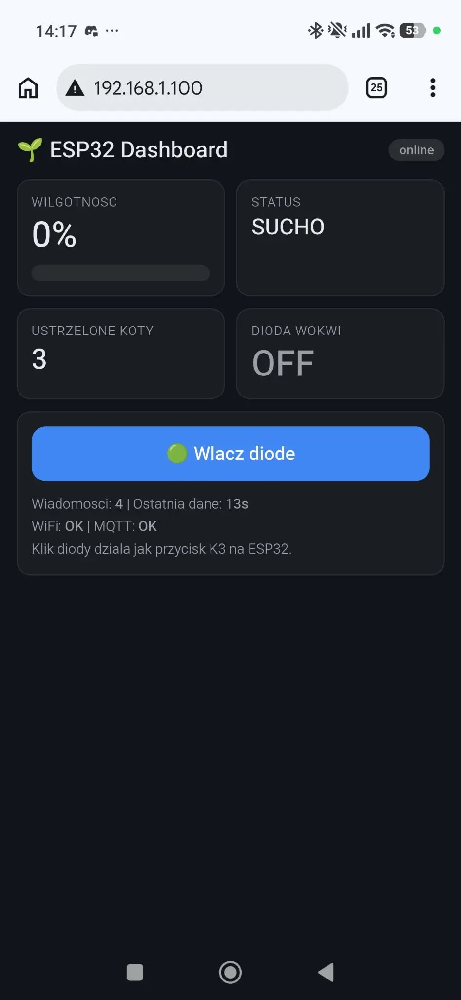
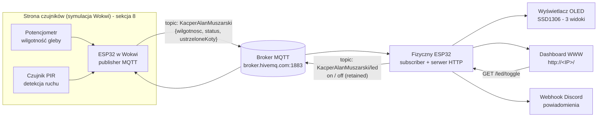
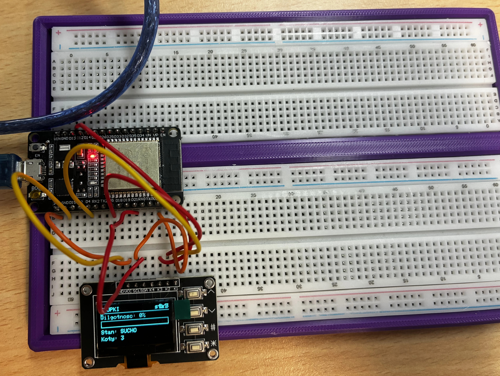
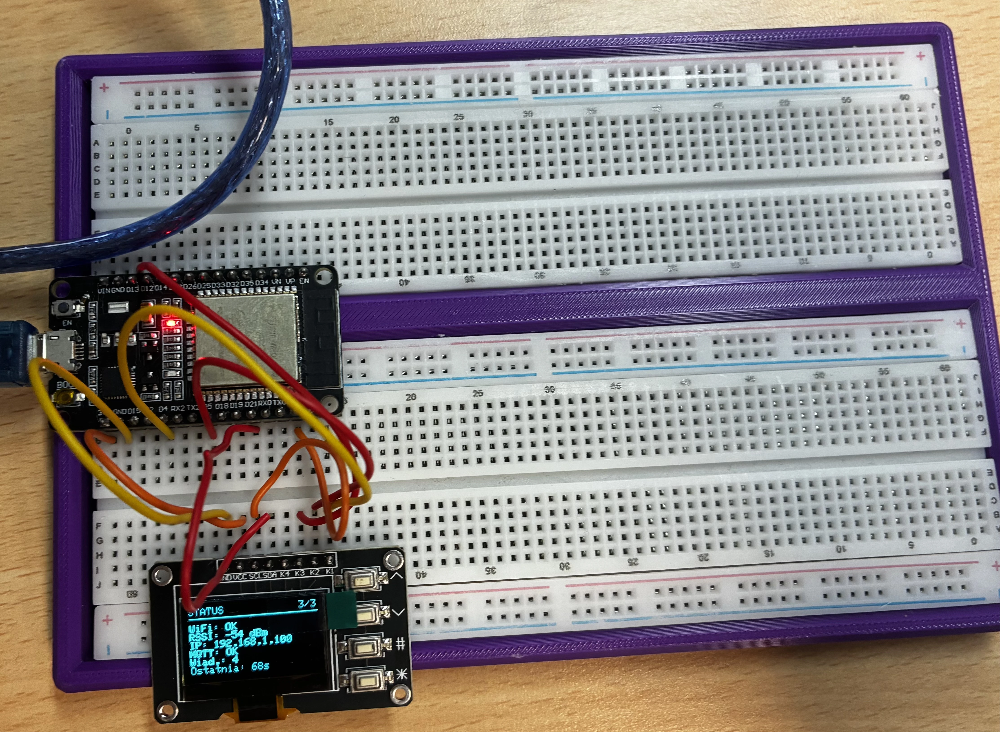
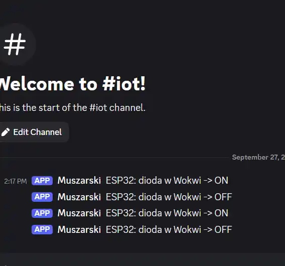
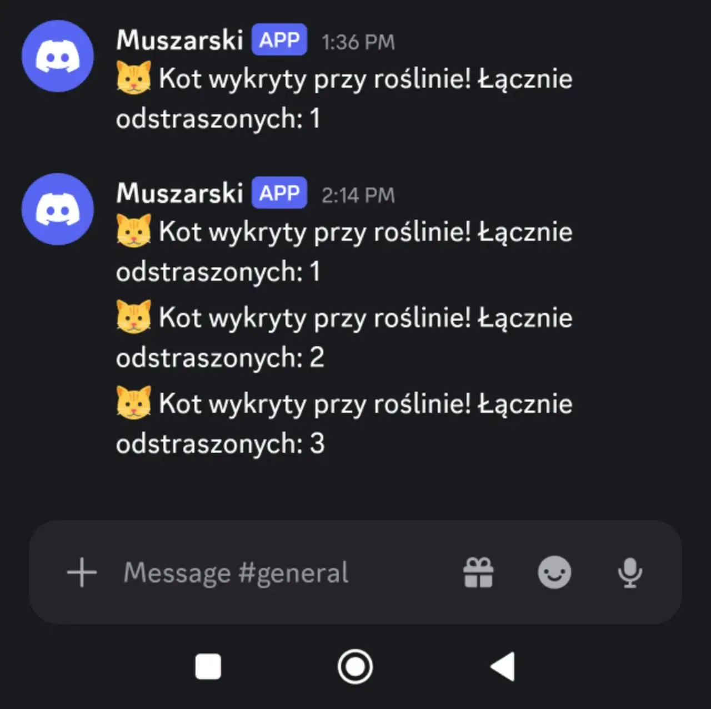

# 🌱 Monitoring rośliny z ESP32: MQTT, dashboard WWW i powiadomienia na Discord

Projekt IoT monitorujący doniczkę: dane o wilgotności i detekcji kota są publikowane
przez **ESP32 symulowany w Wokwi**, trafiają do **brokera MQTT (HiveMQ)**, skąd
odczytuje je **fizyczny ESP32**. Płytki podłączony do WiFi udostępnia:

- **wyświetlacz OLED SSD1306** z trzema widokami przełączanymi przyciskami,
- **dashboard WWW** (`http://<IP_ESP32>/`) w układzie pod telefon,
- **powiadomienia na Discorda** wysyłane przez webhook.

|  |
|:---:|
| *Dashboard dostępny po adresie IP płytki (widok mobilny, ciemny motyw)* |

---

## Spis treści

1. [Cel projektu](#1-cel-projektu)
2. [Architektura systemu](#2-architektura-systemu)
3. [Sprzęt i schemat połączeń](#3-sprzęt-i-schemat-połączeń)
4. [Firmware: `fizyczny_esp32/main.ino`](#4-firmware-fizyczny_esp32mainino)
5. [Dashboard WWW](#5-dashboard-www)
6. [Powiadomienia na Discord](#6-powiadomienia-na-discord)
7. [Uruchomienie krok po kroku](#7-uruchomienie-krok-po-kroku)
8. [Budowa czujników (symulacja Wokwi): do uzupełnienia](#8-budowa-czujników-symulacja-wokwi-do-uzupełnienia)
9. [Rozwiązywanie problemów](#9-rozwiązywanie-problemów)
10. [Struktura repozytorium](#10-struktura-repozytorium)
11. [Bezpieczeństwo i znane ograniczenia](#11-bezpieczeństwo-i-znane-ograniczenia)

---

## 1. Cel projektu

Celem projektu jest zbudowanie działającego systemu IoT „od czujnika do użytkownika":

1. **Zbieranie danych** - czujnik wilgotności i czujnik ruchu (detekcja kota) pomiarują stan rośliny.
2. **Przesyłanie danych** - dane są publikowane w formacie JSON na publicznym brokerze MQTT,
   dzięki czemu nie trzeba łączyć urządzeń bezpośrednio ze sobą.
3. **Prezentacja na urządzeniu** - fizyczny ESP32 wyświetla dane na ekranie OLED
   (trzy widoki: dane, słupki, status połączeń).
4. **Prezentacja zdalna** - ten sam ESP32 pełni rolę serwera HTTP z dashboardem,
   który można otworzyć z poziomu telefonu w tej samej sieci WiFi.
5. **Powiadomianie** - zmiana stanu diody (sterowanej z przycisku lub z dashboardu)
   generuje powiadomienie wysyłane na kanał na Discordzie.

Dzięki temu projekt obejmuje wszystkie warstwy typowego systemu IoT:
**czujnik → komunikacja → przetwarzanie → interfejs użytkownika → powiadomienia**.

---

## 2. Architektura systemu



### Topiki MQTT

| Topik | Kierunek | Zawartość |
|---|---|---|
| `KacperAlanMuszarski` | nadajnik → ESP32 | JSON z danymi pomiarowymi |
| `KacperAlanMuszarski/led` | ESP32 → nadajnik | `on` / `off` - stan diody (wiadomość *retained*) |

Broker `broker.hivemq.com:1883` jest publiczny i nie wymaga logowania - wystarczy
ten sam topic po obu stronach. Płytka łączy się jako **subscriber** i nasłuchuje
danych; równolegle sama publikuje polecenia sterujące diodą.

### Format danych (payload)

Przykładowa wiadomość z topiku danych:

```json
{"wilgotnosc": 0, "status": "SUCHO", "ustrzeloneKoty": 3}
```

Odbiorca (`mqttCallback` w `main.ino`) obsługuje warianty kluczy - dzięki temu
starsze lub nowsze wersje nadajników działają bez zmian w firmware:

| Dane | Klucz podstawowy | Klucz zapasowy | Uwagi |
|---|---|---|---|
| Wilgotność | `wilgotnosc` (0-100) | `pot1` (0-1023) | surowy odczyt ADC przeliczany na % |
| Stan | `status` | `stan` | tekst, np. `SUCHO`, `dobry` |
| Koty | `ustrzeloneKoty` | `koty` | licznik odstraszonych kotów |

Odebrana wiadomość zwiększa licznik `msgs` i odświeża znacznik czasu - jeśli przez
**60 s** nic nie przyjdzie, ekran OLED oznacza dane jako **`stale`** (nieaktualne),
a dashboard pokazuje wiek ostatnich danych.

---

## 3. Sprzęt i schemat połączeń

### Elementy

| Element | Opis |
|---|---|
| ESP32 DevKit | płytka sterująca (WiFi + MQTT + serwer HTTP) |
| Wyświetlacz OLED 0.96" SSD1306 (I2C) | moduł z **4 przyciskami** K1-K4 |
| Breadboard + kable | zestaw prototypowy |

### Okablowanie

```
OLED SSD1306 (moduł z 4 przyciskami)      ESP32
  VCC  ---------------------------------  3V3
  GND  ---------------------------------  GND
  SDA  ---------------------------------  GPIO21
  SCL  ---------------------------------  GPIO22

  K1 (∧) --------------------------------  GPIO4    poprzedni widok
  K2 (∨) --------------------------------  GPIO5    następny widok
  K3 (#) --------------------------------  GPIO13   przełącz diodę w Wokwi
  K4 (✱) --------------------------------  GPIO14   skok do widoku DANE
```

Przyciski mają **wspólne GND modułu**, są czytane na `INPUT_PULLUP`, więc
naciśnięcie = stan `LOW`. Do każdego przycisku **nie są potrzebne rezystory**.
W firmware działa filtr *debounce* (30 ms).

|  |  |
|:---:|:---:|
| *Widok danymi - suchość, stan, koty* | *Widok STATUS - WiFi, RSSI, IP, MQTT* |

---

## 4. Firmware: `fizyczny_esp32/main.ino`

Plik `fizyczny_esp32/main.ino` to kompletny firmware odbiornika. Zawiera pięć bloków:

| Blok | Odpowiedzialność |
|---|---|
| **WiFi** | utrzymanie połączenia, ponowna próba co 10 s |
| **MQTT** | subskrypcja topiku danych, publikacja poleceń diody |
| **WebServer (HTTP)** | dashboard i API dla telefonu |
| **Discord webhook** | powiadomienia o zmianie stanu diody |
| **Wyświetlacz + przyciski** | 3 widoki, przełączanie, `debounce` |

### 4.1 Widoki wyświetlacza

| # | Nazwa | Zawartość |
|---|---|---|
| 1/3 | **DANE** | wilgotność dużą czcionką, stan, liczba odstraszonych kotów, wiek danych |
| 2/3 | **SLUPKI** | poziomicowy pasek wypełnienia wilgotności 0-100 %, stan, koty |
| 3/3 | **STATUS** | WiFi (`OK`/`BRAK`), siła sygnału RSSI, **adres IP**, MQTT, licznik wiadomości, czas ostatniej aktualizacji |

W nagłówku każdego widoku jest numer `x/3`, a gdy dane przestają napływać -
dopisek **`stale`**.

### 4.2 Przyciski

| Przycisk | Pin | Funkcja |
|---|---|---|
| K1 (∧) | GPIO4 | poprzedni widok |
| K2 (∨) | GPIO5 | następny widok |
| K3 (#) | GPIO13 | przełącz diodę w symulacji Wokwi (wysyła `on`/`off` + webhook na Discord) |
| K4 (✱) | GPIO14 | skok do widoku DANE |

### 4.3 Pętla główna (`loop`)

Kolejność w pętli jest celowa - **ekran ma priorytet**, żeby nigdy nie „zamarł”:

1. **Render ekranu** - jeśli coś się zmieniło (`viewDirty`) albo minęło 200 ms.
2. **Sieć i serwer HTTP** - `wifiEnsureConnected()` + `server.handleClient()` (nieblokujące).
3. **MQTT** - utrzymanie połączenia, wysłanie oczekującego stanu diody (z flagą *retained*), `mqtt.loop()`.
4. **Webhook Discord** - wysyłany dopiero poza obsługą przycisku (HTTPS trwa, więc nie blokuje reakcji na UI).
5. **Obsługa przycisków** + `delay(5)`.

| Stała | Wartość | Znaczenie |
|---|---|---|
| `RENDER_MS` | 200 ms | częstotliwość odświeżania ekranu |
| `MQTT_RETRY_MS` | 10 s | co ile ponawiamy połączenie z WiFi/brokerem |
| `DATA_STALE_MS` | 60 s | po tym czasie dane uznajemy za nieaktualne |
| `DEBOUNCE_MS` | 30 ms | filtr drgań styków przycisków |
| `MQTT_CONN_TIMEOUT_S` | 2 s | maksymalny czas blokady `connect()` (domyślnie 15 s!) |

Dzięki krótkiemu limitowi połączenia MQTT i rozdzieleniu zadań pętla pozostaje
responsywna także przy niedostępnym brokerze.

---

## 5. Dashboard WWW

Strona jest **osadzona w firmware** (HTML w `PROGMEM`, nie zajmuje RAM-u)
i serwowana przez `WebServer` na porcie 80 - wystarczy otworzyć
`http://<IP_ESP32>/` na telefonie w tej samej sieci WiFi.

**Cechy layoutu (typowego dla telefonu):**

- ciemny motyw, duże elementy do dotyku (przycisk `padding: 14px`),
- siatka **2 kolumny** (`grid-template-columns: 1fr 1fr`), karty z zaokrągleniami,
- karta na całą szerokość (`grid-column: 1/-1`) na przycisk i metryki,
- auto-odświeżanie co **2 s** przez `fetch('/api')` - bez przeładowania strony,
- pigułka statusu połączenia: `online` / `brak połączenia`,
- pasek postępu wilgotności animowany (`transition: width .4s`).

**Karty:** Wilgotność (z paskiem), Status, Ustrzelone koty, Dioda Wokwi + duży
przycisk przełączający i stopka z metrykami (liczba wiadomości, wiek danych,
stan WiFi i MQTT).

### Endpointy HTTP

| Metoda i ścieżka | Opis |
|---|---|
| `GET /` | strona dashboardu (HTML z `PROGMEM`) |
| `GET /api` | aktualny stan jako JSON |
| `GET /led/toggle` | przełącz diodę - dokładnie to samo co przycisk K3 |
| `GET /led?state=on\|off` | ustaw diodę wprost (`1`, `true` też akceptowane) |
| `*` (inne) | `404` - odpowiedź `Nie ma` |

Przykładowa odpowiedź `GET /api`:

```json
{
  "hum": 0,
  "stan": "SUCHO",
  "koty": 3,
  "led": false,
  "msgs": 4,
  "age": "13s",
  "wifi": "OK",
  "mqtt": "OK"
}
```

Pola `hum`/`koty` mają wartość `-1`, gdy nie odebrano jeszcze żadnych danych,
`age` to wiek ostatniej wiadomości MQTT w sekundach, a `wifi`/`mqtt` to stan
połączeń (`OK`/`BRAK`).

---

## 6. Powiadomienia na Discord

Webhook Discord jest wysyłany przez `WiFiClientSecure` (HTTPS). Ponieważ nawiązanie
połączenia TLS chwilę trwa, wiadomość **nie jest wysyłana wewnątrz obsługi
przycisku**, tylko odkładana flagą `webhookPending` i nadawana w kolejnej
iteracji pętli - UI i ekran reagują natychmiast.

```json
{"content": "ESP32: dioda w Wokwi -> ON"}
```

|  |
|:---:|
| *Powiadomienie wysyłane przez firmware przy przełączeniu diody (K3 lub dashboard)* |

|  |
|:---:|
| *Przykładowa historia kanału - m.in. alerty o wykryciu kota przy roślinie (patrz sekcja 8)* |

### Konfiguracja webhooka

1. Na Discord: **Ustawienia serwera → Integracje → Webhooks → Nowy webhook**.
2. **Kopiuj adres URL** - to jest `DISCORD_WEBHOOK`.
3. Wklej go do pliku `secrets.h` (patrz [sekcja 7](#7-uruchomienie-krok-po-kroku)).
   Adres webhooka to tajny token - **nie umieszczamy go w repozytorium**.

---

## 7. Uruchomienie krok po kroku

### 1) Biblioteki (Arduino IDE → *Sketch → Include Library → Manage Libraries*)

| Biblioteka | Producent | Do czego |
|---|---|---|
| `Adafruit SSD1306` | Adafruit | sterowanie wyświetlaczem |
| `Adafruit GFX Library` | Adafruit | grafika (czcionki, kształty) |
| `PubSubClient` | Nick O'Leary | klient MQTT |
| `ArduinoJson` | Benoit Blanchon | parsowanie payloadu |

### 2) Sekrety (bez tego się nie skompiluje)

```bash
cd fizyczny_esp32
cp secrets.h.example secrets.h      # Windows: copy secrets.h.example secrets.h
```

Następnie otwórz `secrets.h` i uzupełnij **swoje** wartości:

```cpp
const char* WIFI_SSID = "nazwa-twojej-sieci";
const char* WIFI_PASS = "twoje-haslo";
const char* DISCORD_WEBHOOK = "https://discord.com/api/webhooks/...";
```

Plik `secrets.h` jest na liście `.gitignore` i **nigdy nie trafia do gita** -
w repo znajduje się wyłącznie `secrets.h.example` z wartościami przykładowymi.

### 3) Kompilacja i wgranie

1. Płytka: **Tools → Board → ESP32 Arduino → ESP32 Dev Module**, port COM.
2. Otwórz `fizyczny_esp32/main.ino` i wgraj (Upload).
3. Otwórz **Monitor szeregowy 115200 baud** - zobaczysz logi połączenia z WiFi i brokerem.

### 4) Sprawdzenie

1. Na ekranie OLED wybierz widok **STATUS** (przycisk K2) - zobaczysz adres IP, np. `192.168.1.100`.
2. Na telefonie (ta sama sieć WiFi) otwórz `http://<IP>/`.
3. Kliknij przycisk na dashboardzie albo naciśnij K3 - dioda w symulacji Wokwi
   się przełączy, a na Discordzie pojawi się powiadomienie.

---

## 8. Budowa czujników (symulacja Wokwi): do uzupełnienia

> **Miejsce na dokumentację symulatora czujników** (ESP32 w Wokwi), który publikuje
> dane na topik `KacperAlanMuszarski`. Uzupełnia ją członek zespołu odpowiedzialny
> za czujniki. Do opisania:
>
> - **schemat obwodu** - co jest podłączone do którego pinu ESP32,
> - **poszczególne czujniki** - jak działają i jak odczyt ich wartości przekłada się
>   na pola payloadu (`wilgotnosc`, `status`, `ustrzeloneKoty`),
> - **jak uruchomić symulację** i wygenerować dane widoczne na wyświetlaczu
>   i dashboardzie.

---

## 9. Rozwiązywanie problemów

| Objawa | Możliwa przyczyna | Co zrobić |
|---|---|---|
| Ekran pokazuje `stale`, dashboard `age` rośnie | brak publikującego na topiku | uruchom symulację Wokwi i sprawdź topik |
| `MQTT: BRAK` na ekranie STATUS | brak internetu / zły broker | sprawdź WiFi, `broker.hivemq.com:1883` |
| `WiFi: BRAK` | zmieniło się hasło | popraw `secrets.h` i wgraj ponownie |
| `Nie ma` (404) | zły adres ścieżki | użyj `/`, `/api`, `/led/toggle` |
| Strona się nie otwiera | inne IP / inna sieć | sprawdź IP w widoku **STATUS**, telefon musi być w tej samej sieci |
| `Blad: nie znaleziono SSD1306` | okablowanie / adres I2C | sprawdź SDA=21, SCL=22, zasilanie; adres `0x3C` (bywa `0x3D`) |
| Przyciski reagują podwójnie | brak *debounce* | w firmware jest `DEBOUNCE_MS = 30` |
| Dashboard pokazuje `brak połączenia` | ESP32 restartuje się / brak WiFi | obserwuj monitor szeregowy |

---

## 10. Struktura repozytorium

```
iot_zajecia/
├── README.md                    # ta dokumentacja
├── .gitignore                   # m.in. secrets.h i artefakty budowy
├── assets/                      # zdjęcia i zrzuty ekranu
│   ├── fig1.webp                # breadboard - widok danych na OLED
│   ├── fig2.webp                # breadboard - widok STATUS
│   ├── fig3.webp                # Discord - przykładowe alerty
│   ├── fig4.webp                # dashboard WWW na telefonie
│   └── fig5.webp                # Discord - powiadomienie o diodzie
└── fizyczny_esp32/
    ├── main.ino                 # firmware: MQTT + OLED + HTTP + Discord
    ├── secrets.h.example        # wzorzec sekretów (trafia do repo)
    └── secrets.h                # Twoje sekrety (lokalnie, w .gitignore)
```

---

## 11. Bezpieczeństwo i znane ograniczenia

- **Sekrety** (SSID, hasło WiFi, URL webhooka) znajdują się wyłącznie w lokalnym
  pliku `secrets.h`, który jest na liście `.gitignore`. Do repozytorium trafia
  tylko `secrets.h.example` z wartościami przykładowymi.
- **Webhook Discorda to tajny token** - każdy, kto go zna, może wysyłać wiadomości
  na kanał. Jeśli token wycieknie, wygeneruj nowy w ustawieniach serwera.
- **Broker `broker.hivemq.com` jest publiczny** - dane i polecenia widzi każdy,
  kto zna topik.
- **Dashboard nie ma TLS ani logowania** - działa tylko w sieci LAN i nie jest
  przeznaczony do wystawienia na zewnątrz.
- **`setInsecure()`** przy webhooku oznacza brak weryfikacji certyfikatu TLS
  (świadome uproszczenie na potrzeby projektu).
- Dane na wyświetlaczu pochodzą z symulacji - wartość `0 %` i stan `SUCHO`
  to wynik ustawienia potencjometru w symulatorze, nie błąd odczytu.
